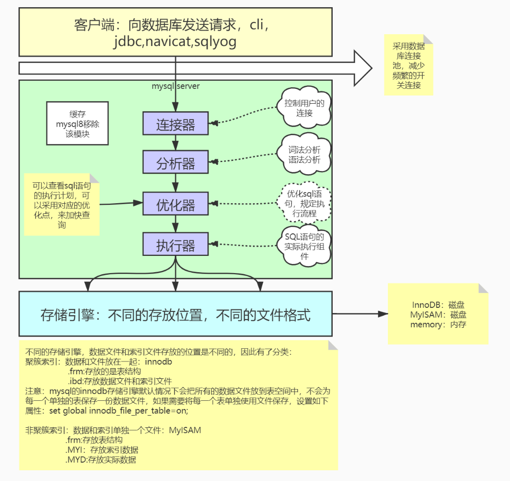
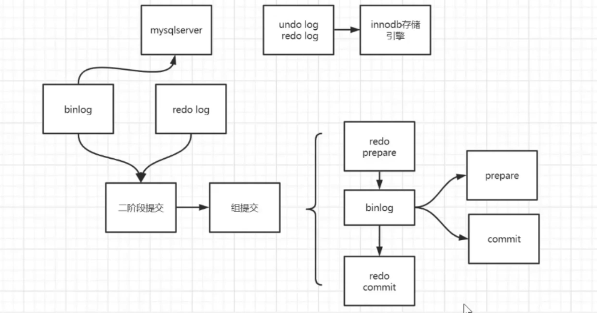
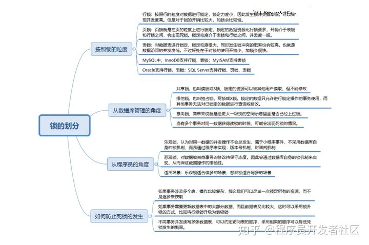
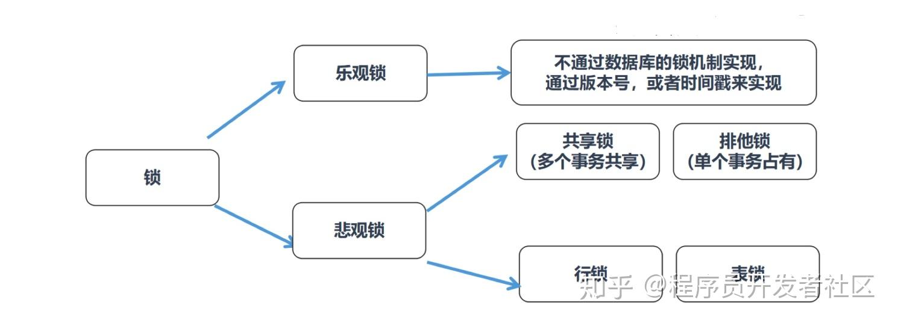

# MySQL

## 一、安装

### 1、CentOS7安装mysql

~~~shell
wget -i -c http://dev.mysql.com/get/mysql57-community-release-el7-10.noarch.rpm
yum -y install mysql57-community-release-el7-10.noarch.rpm
yum -y install mysql-community-server
~~~

## 二、设置

###  1、启动设置

查看安装后设置的临时root密码

~~~shell
grep "password" /var/log/mysqld.log
~~~

修改初始密码

~~~mysql
ALTER USER 'root'@'%' IDENTIFIED BY 'new password';
~~~

查看初始密码规则和修改

~~~mysql
SHOW VARIABLES LIKE 'validate_password%';   
set global validate_password_length=4;		#设置密码长度
set global validate_password_policy=0;		#设置密码验证策略
~~~

开启远程访问

~~~mysql
grant all privileges on *.* to 'root'@'%' identified by 'password' with grant option;
flush privileges; 
~~~

查看mysql默认信息

~~~mysql
status
~~~

### 2、编码设置

修改默认编码（默认配置文件位置：/etc/my.cnf）

~~~shell
[mysqld]
character-set-server=utf8
collation-server=utf8_general_ci
[client]
default-character-set=utf8
~~~

查看MySQL中支持的字符集和比较规则

~~~mysql
SHOW CHARSET [LIKE 匹配的模式];
SHOW COLLATION [LIKE 匹配的模式];
~~~

MySQL有四个级别的字符集和比较规则

- 服务器级别：`character_set_server`表示服务器级别的字符集，`collation_server`表示服务器级别的比较规则

- 数据库级别：`character_set_database`表示当前数据库的字符集，`collation_database`表示当前默认数据库的比较规则

  ~~~mysql
  CREATE DATABASE 数据库名
      [[DEFAULT] CHARACTER SET 字符集名称]
      [[DEFAULT] COLLATE 比较规则名称];
  
  ALTER DATABASE 数据库名
      [[DEFAULT] CHARACTER SET 字符集名称]
      [[DEFAULT] COLLATE 比较规则名称];
  ~~~

- 表级别：

  ~~~mysql
  CREATE TABLE 表名 (列的信息)
      [[DEFAULT] CHARACTER SET 字符集名称]
      [COLLATE 比较规则名称]];
  
  ALTER TABLE 表名
      [[DEFAULT] CHARACTER SET 字符集名称]
      [COLLATE 比较规则名称];
  ~~~

- 列级别：

  ~~~mysql
  CREATE TABLE 表名(
      列名 字符串类型 [CHARACTER SET 字符集名称] [COLLATE 比较规则名称],
      其他列...
  );
  
  ALTER TABLE 表名 MODIFY 列名 字符串类型 [CHARACTER SET 字符集名称] [COLLATE 比较规则名称];
  ~~~

编码转换

- 客户端使用操作系统的字符集编码请求字符串，向服务器发送的是经过编码的一个字节串。
- 服务器将客户端发送来的字节串采用`character_set_client`代表的字符集进行解码，将解码后的字符串再按照`character_set_connection`代表的字符集进行编码。
- 如果`character_set_connection`代表的字符集和具体操作的列使用的字符集一致，则直接进行相应操作，否则的话需要将请求中的字符串从`character_set_connection`代表的字符集转换为具体操作的列使用的字符集之后再进行操作。
- 将从某个列获取到的字节串从该列使用的字符集转换为`character_set_results`代表的字符集后发送到客户端。

- 客户端使用操作系统的字符集解析收到的结果集字节串。

| 系统变量                 | 描述                                                         |
| ------------------------ | ------------------------------------------------------------ |
| character_set_client     | 服务器解码请求时使用的字符集                                 |
| character_set_connection | 服务器处理请求时会把请求字符串从`character_set_client`转为`character_set_connection` |
| character_set_results    | 服务器向客户端返回数据时使用的字符集                         |

> 一般情况下要使用保持这三个变量的值和客户端使用的字符集相同。
>
> 比较规则的作用通常体现比较字符串大小的表达式以及对某个字符串列进行排序中。

## 三、性能监控

### 1、Show Profile

开启性能监控

~~~mysql
set profiling=1;
~~~

查看执行情况

~~~mysql
show profiles;		查看执行时间
show profile;		查看详细（默认查看最近执行的sql语句）
show profile (all/block io/context switches/cpu/IPC/page faults/source/swaps) for query query_id;  指定sql语句进行查看指定内容
#all：显示所有性能信息
#block io：io操作次数
#context switches：显示上下文切换次数，被动和主动
#cpu：显示用户cpu时间，系统cpu时间
#IPC：显示发送和接收的消息数量
#page faults：显示页错误数量
#source：显示源码中的函数名称和位置
#swaps：显示swap次数
~~~

### 2、performance_schema

### 3、show processlist

实时监控查看当前连接情况

## 四、mysql架构



## 五、索引

### 1、回表

### 2、索引覆盖

### 3、最左匹配（组合索引）

### 4、索引下推

数据存储在磁盘中， mysql有自己的服务，所以mysql服务在获取数据时需要和磁盘发生交互。

select * from table where name=xxx and age=xxx

+ 没有索引下推：先从存储引擎中拉取数据（根据name筛选数据），然后在mysql server中根据age进行数据筛选。
+ 有索引下推：直接在存储引擎中根据name和age筛选获取数据，不需要server做任何的数据筛选。

优点：减少IO量，提高速度，降低内存使用。索引下推唯一的缺点就是需要在磁盘上多做数据的筛选，原来放在内存中的现在放到了磁盘上，这样看起来成本较高，但是数据是排序的，所有的数据时聚集存储的，所以性能影响不会太大，而且整体IO量会大大减少，反而会提升性能。

### 5、MRR   |   FIC

MRR：mult_range_read（回表前先对id进行排序，然后进行范围查找，批量读取数据）

FIC：fast_index_creation

+ 在mysql5.5之前，在一个已经存在数据的表上增加或者删除索引是很耗时的。索引增加或删除按如下方式：
  -创建一个新的、空的临时表
  -逐一拷贝数据到新表，插入数据行同时更新索引
  -删除原表
  -将新表的名字改为原表的名字
+ FIC会给当前表添加一个Share锁，不会有创建临时文件的资源消耗，但此时如果有DML操作，数据会不一致，所以要加锁，读取不会有问题

### 6、索引分类

+ 主键索引
+ 唯一索引
+ 普通索引（辅助索引/二级索引）
+ 全文索引
+ 组合索引

### 7、索引匹配命中方式

+ 全值匹配
+ 最左匹配
+ 匹配列前缀
+ 匹配范围值
+ 精确匹配某一列并范围匹配另一列
+ 只访问索引的查询

### 8、索引匹配失效情况

+ 模糊查询：select * from staffs where name like '%y%';
+ 组合索引中间某个使用了范围查找，后面索引失效：select * from staffs where name ='xxx' and age>10 and pos=20;（name、age、pos是组合索引，只会用到name，age索引）

### 9、聚簇索引和非聚簇索引

区分标准：数据和索引是否是聚集存储的。innodb的主键索引就是聚簇索引。myisam、innodb的二级索引都是非聚簇索引。

## 六、sql优化

### 1、数据类型优化

1. 更小的数据类型通常更好
2. 数据类型简单就好
3. 尽量避免值为null（在mysql中null不等于null，可为null的列会使得索引、索引优化和值的比较都更加复杂）

### 2、索引相关优化

+ 使用索引列进行查询时，尽量不要使用表达式，把计算放到业务层而不是数据库层

  ~~~mysql
  select actor_id from actor where actor_id+1=5;
  ~~~

+ 尽量使用主键查询，而不是其他索引，因为主键查询不会触发回表

+ 尽量使用前缀索引，可以减少数据量

+ 尽量使用索引扫描来排序

+ union all、in、or都能够使用索引，但是推荐使用in

+ 范围列可以用到索引，但范围列后面的列无法用到索引，索引最多用于一个范围列

+ 强制类型转换会触发全表扫描

+ 更新十分频繁，数据区分度不高的字段不建议建立索引

+ 索引列不建议可设置为null

+ 单表索引建议控制在5个以内，组合索引字段数控制个5个以内

## 七、存储引擎

### 1、什么是存储引擎

不同的数据文件在磁盘的不同组织形式

### 2、常用存储引擎

+ innodb
+ myisam
+ memory

### 3、innodb和myisam区别

1. innodb支持事务，myisam不支持
2. innodb支持外键，myisam不支持
3. innodb支持表锁和行锁，myisam支持表锁
4. innodb在5.6版本之后支持全文索引，myisam一直支持
5. 索引不同，innodb索引的叶子节点直接存放数据，myisam存放地址

## 八、事务

### 1、原子性

undo log：保存的是和执行操作相反的操作

### 2、一致性

一个事物操作前后状态一致，是事务的根本性追求，通过原子性、持久性、隔离性来实现

### 3、隔离性（通过锁+MVCC来实现）

隔离级别由低级到高级，隔离级别越低，效率越高，越不安全

读未提交（会引发脏读、幻读、不可重复读）

+ 脏读：一个事务读取了另外一个事务未提交的数据

  ```text
  事务1： A给B转账500，但是事务未提交。
  事务2： B查看了账户，发现A转过来500，本来只转300过来就好，发现多转了200，心里美滋滋。。。
  事务1： A及时发现多转了200，修改了转300，提交事务。
  ```

+ 不可重复读：在同一个事务中，执行相同的sql语句，查询到的结果是不同的

  ```text
  事务1：B去买东西，卡里有500块钱，消费100，还没提交事务。
  事务2：B的老婆把B的500块钱转出去了，已提交事务。
  事务1：B此时提交事务，支付不了。再次读取发现卡里没钱支付。
  ```

+ 幻读：一个事务按相同的查询条件重新读取以前检索过的数据，却发现其他事务插入了满足其查询条件的新数据

  ```text
  事务1：B的老婆查看B的卡消费记录，目前共消费了500元。
  事务2：B此时刚在外面请朋友吃完饭，付款了100，事务已提交。
  B的老婆决定把账单打印出来，晚上跟B对账，却发现打印出来的消费为600元。她刚才明明看到是500，怎么是600，难道是幻觉？
  ```

读已提交（会引发幻读、不可重复读）

可重复读（mysql默认的隔离级别）（会引发幻读）

串行化（可以避免以上问题，但是性能很差）

### 4、持久性 

redo log：主要是为了防止crash safe，通过WAL（write ahead log预写日志）实现，如果发生异常情况，就算数据没有持久化成功，只要日志持久化成功，依然可以进行恢复。



## 九、锁

### 1、锁作用

数据库为了保证数据的一致性和完整性，而使各种共享资源在被并发访问时变得有序所设计的一种规则。

### 2、锁分类



+ 按锁的粒度

  行锁：对指定记录加锁，锁定颗粒度最小，发生争用锁定资源的概率最小，能尽可能大的提高数据库并发能力，带来的消耗最大，最容易发生死锁。

  ~~~
  死锁：多个事务持有锁并互相循环等待其他事务的锁导致所有事务都无法继续执行
  ~~~

  页锁：对页进行锁定，锁定资源比行锁多，开销处于表锁和行锁之间。

  表锁：对表进行锁定，锁定颗粒度最大，实现简单，能够很好避免死锁问题，但出现争用锁定资源的概率最大，并发度也会大大降低。

+ 从数据库管理角度

  共享锁：共享锁，也叫读锁或者S锁，共享锁锁定的资源可以被其他用户读取，但不能修改。

  排他锁：排他锁也叫做独占锁，写锁或者 X 锁，排他锁锁定的数据只允许进行锁定操作的事务使用，其他事务无法对已锁定的数据进行查询或者修改。

+ 从程序员角度

  乐观锁：乐观锁认为对同一个数据并发操作不会总发生，是小概率事件，因此不用每次对数据进行更新或者删除。

  悲观锁：悲观锁（Pessimistic Locking），通过数据库自身的锁机制来实现，从而保证数据操作的排他性。



## 十、MVCC


## 十一、主从复制、读写分离


