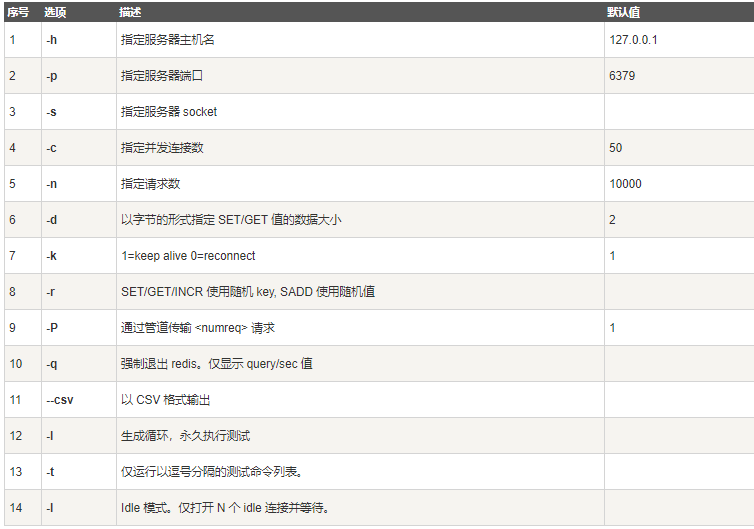
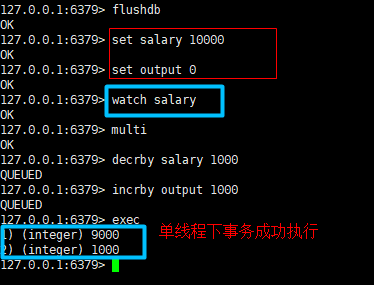
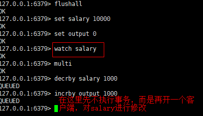
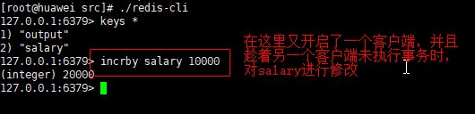
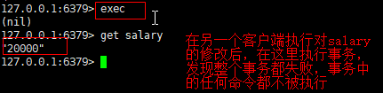

# Redis

## 一、性能测试工具redis-benchmark

~~~
redis-benchmark -h localhost -p 6379 -c 500 -n 30000
~~~

## 二、常用命令

具体命令可参考：https://redis.io/commands

~~~
切换数据库：select 0
清空当前数据库：flushdb
清空所有数据库：flushall
查询所有key：keys *
存值：set key value
取值：get key
查询数据库大小：dbsize
查询key是否存在（存在返回1，否则返回0）：exists key
移除key：move key 1
key设置过期时间：expire key timeout
查看key剩余存活时间：ttl key
查看key类型：type key
~~~

## 三、redis支持的数据类型

### 1、String

~~~
求value长度：strlen key
追加内容：append key "xxx"
自增：incr key
自增指定步长：incr key num
自减：decr key
自减指定步长：decr key num
获取范围字符串（闭区间）：getrange key startnum endnum
设置范围字符串替换（闭区间）：setrange key startnum "xxx"
设置字符串同时设置过期时间（key存在则覆盖，不存在创建）：setex key timeout value
key不存在就设置，存在不覆盖：setnx key value
批量设置值：mset k1 v1 k2 v2 k3 v3
批量获取值：mget k1 k2 k3
批量设置值（操作为原子性）：msetnx k1 v1 k2 v2 k3 v3
存取对象：mset/mget xxx:xxx:xxx value
先获取再设置，如果不存在就返回nil：getset k1 v1
~~~

### 2、List

~~~
左插：lpush key value
左删：lpop key 
右插：rpush key value
右删：rpop key
获取列表全部元素：lrange key 0 -1
通过下标获取元素：lindex key xx
获取列表长度：llen key
移除n个指定元素：lrem key n value
列表截取（闭区间）：ltrim key startindex endindex
移除列表中的最后一个元素并将这个元素放到一个新的列表中：rpoplpush key1 key2
判断列表是否存在：exists key
更新列表中指定下标的元素的value,前提是该下标必须有值，否则报错：lset key index value
列表中插入值（前插和后插）：linsert key before/after 列表中的value 插入的value
~~~

### 3、Set

~~~
添加元素：sadd key v1 [v2 v3]
查看所有元素：smembers key
查询元素个数：scard key
判断set中是否存在某元素：sismember key value
移除某个元素：srem key value
随机抽取n个元素（默认一个）：srandmember key n
随机移除n个元素（默认一个）：spop key n
将一个集合中的元素移动到另一个集合中：smove key1 key2 value
差集：sdiff key1 key2
并集：sunion key1 key2
交集：sinter key1 key2
~~~

### 4、hash

~~~
添加元素：hset key field value
获取元素：hget key field
获取hash中的所有值：hgetall key
批量添加：hmset key field1 value1 field2 value2
批量获取：hmget key field1 field2
删除指定字段：hdel key field
获取hash的长度：hlen key
判断hash中的字段是否存在：hexist key field
获取所有的key：hkeys key
获取所有的value：hvals key
指定增量：hincrby key field num
~~~

### 5、zset

~~~
添加数据：zadd key num value
获取所有数据：zrange key 0 -1 [withscores]
获取所有数据按照num排序：zrangebyscore key -inf +inf withscores
移除元素：zrem key value
获得元素个数：zcard key
获取指定区间成员数量：zcount key num1 num2
~~~

### 6、geospatial

~~~
添加位置信息：geoadd key 经度 纬度 name
获取指定地区经纬度：geopos key name
获取两地之间直线距离：geodist key name1 name2 m|km|mi|ft
查找以某一维度经度为中心，半径为指定距离的地区：georadius key 经度 纬度 半径 m|km|mi|ft
查找以某一城市为中心，半径为指定距离的地区：georadiusbymember key name 半径 m|km|mi|ft
~~~

### 7、bitmaps

bitmap即位存储，适用于只有两面性的内容。如：可以用bitmap存储用户是否登录，是否注册，是否打卡等等。bitmap的值只有0和1两个值。

~~~
存储数据：setbit key 编号 0|1
获取指定下标的值：getbit key 编号
统计bitmaps中1的位数：bitcount key 开始位置 结束位置
~~~

### 8、hyperloglogs

用于统计基数（即不重复的数据）,可以用于统计网页访问量

~~~
添加：pfadd key num1 num2 num3 num4 num5...
统计基数：pfcount key
合并：pfmerge new_key key1 key2
~~~

## 四、redis的事务操作

### 1、事务

redis的单条命令保证原子性，但是redis的事务不保证原子性

> redis的事务没有隔离级别。redis事务实际上就是一组命令的集合，这些命令在事务中会被序列化，然后按照命令的先后顺序一次性全部执行，在执行的过程中不能被打断。
> 即：redis的事务在执行时是一次性，顺序性和排他性的

~~~
开启事务：multi
命令入队:
执行事务:exec
~~~

~~~
放弃事务：discard
~~~

> 事务异常：在开启事务后，如果编写的命令有语法错误，则会立即报错，且整个事务队列中的所有命令都不会执行；如果在开启事务后，命令中没有语法错误，但是却有运行错误，即命令能够成功入队，但是不能够执行，则在事务提交后只有该命令抛错，其他命令可以正常执行。

### 2、redis乐观锁

> **乐观锁**：就是它会认为所有的事务都不会失败，因此它不会给事务上锁。它只会在更新的时候判断在此期间是否有人修改过数据
> **悲观锁**：它认为所有的事务都会执行失败，因此做任何事情它都会加锁，这样是及其影响效率的。

redis的乐观锁实现命令：watch
单线程下运行：

多线程修改值

如果事务执行失败，需要先解锁，再加锁，解锁命令为：unwatch